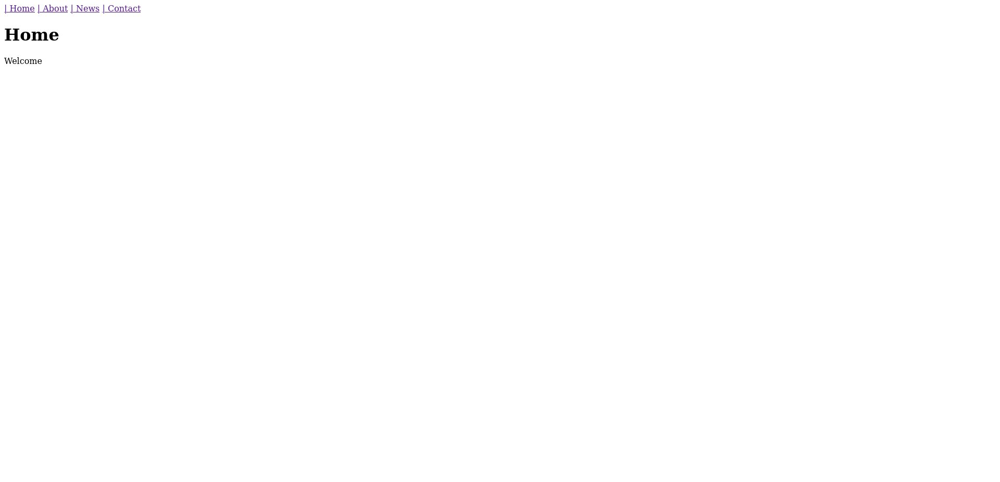
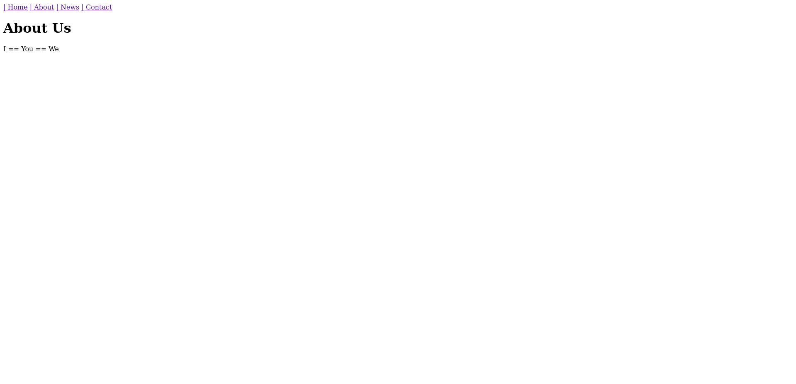

# Pages Project

A simple multi-page website built with Django. The project demonstrates Django's template system, URL routing, and class-based views across multiple pages.

## Pages

- **Home** — Landing page
- **About** — About page
- **News** — News page
- **Contact** — Contact page

## Tech Stack

- Python 3.13
- Django
- Pipenv

## Project Structure

```
pagesProject/
├── config/          # Django project settings & URL config
├── pagesapp/        # Main application (views, urls, tests)
├── templates/       # HTML templates (base, home, about, news, contact)
├── images/          # Project screenshots
├── Pipfile          # Python dependencies
└── manage.py
```

## Getting Started

1. Install dependencies:
   ```
   pipenv install
   ```

2. Activate the virtual environment:
   ```
   pipenv shell
   ```

3. Run the development server:
   ```
   python manage.py runserver
   ```

4. Run tests:
   ```
   python manage.py test
   ```

## Screenshots

| Home | About | News | Contact |
|------|-------|------|---------|
|  |  |  |  |
